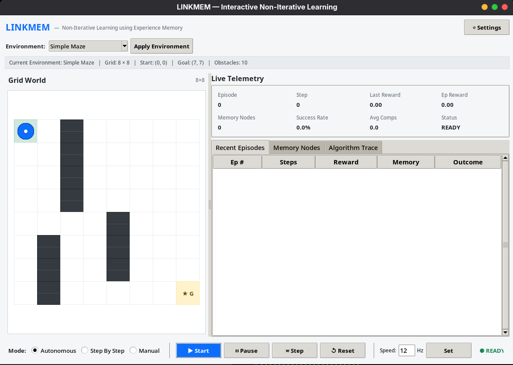

# LINKMEM — Interactive Non-Iterative Learning using Linked-List Experience Memory

LINKMEM is an interactive reinforcement learning and navigation project demonstrating non-iterative learning with an explicit singly linked-list experience memory. Instead of using neural networks, gradient descent, backpropagation, or iterative training epochs, the agent stores observed experiences as nodes in a linked list and retrieves past decisions using nearest-neighbor search.

## Screenshots



![Algorithm Trace and Memory] 

## What does it do?

The agent navigates a 2D grid world from a start position to a goal while learning to avoid obstacles and dead ends.

At each step:
1. **Perception**: The agent senses a 6-dimensional continuous state (normalized distances to the goal along X and Y, plus binary indicators for walls or obstacles in the four adjacent cells).
2. **Memory Lookup**: It scans through its linked-list memory to find the closest previous experience based on Euclidean distance.
3. **Action Selection**:
   - If the nearest stored state is within a distance threshold (theta), the agent reuses the action stored in that node.
   - If the state is novel (distance exceeds theta), the agent explores by taking a heuristic step toward the goal or picking an unblocked direction, prepending a new experience node to the head of the linked list.
4. **Environment Step**: The environment updates the agent's position and returns a reward.
5. **Sample-Average Update**: The node's Q-value is updated non-iteratively using a running sample average:
   `Q_new = Q_old + (reward - Q_old) / n`
   where `n` is the visit count. No Bellman updates, discount factors (gamma), or TD errors are used.
6. **Cycle Avoidance**: Episode-local tracking prevents the agent from ping-ponging between neighboring cells or looping in dead ends.

## Features

- **Interactive GUI**: Built with Tkinter, featuring a live grid visualizer, real-time telemetry cards, an algorithm step inspector, and an experience memory table.
- **Multiple Modes**:
  - **Autonomous**: Runs the simulation continuously at an adjustable speed (1 to 100 Hz).
  - **Step-by-Step**: Advances the simulation one perception-action-update step at a time.
  - **Manual**: Lets you control the agent directly with keyboard controls (W/A/S/D or Arrow keys).
- **Environment Presets**:
  - **Empty Grid**: Open 8x8 space for baseline testing.
  - **Simple Maze**: Deterministic maze with a single corridor.
  - **Complex Maze**: Multi-corridor maze requiring backtracking and loop avoidance.
  - **Random Obstacles**: Configurable obstacle count and seed, validated with breadth-first search (BFS) to guarantee a reachable path.
  - **Custom Environment**: Interactive visual editor allowing you to place walls and set custom start/goal positions.
- **Pruning Policies**: Supports memory eviction policies (such as evicting the lowest Q-value node) when memory capacity is reached.
- **Empirical Benchmarks**: Built-in benchmark suite to evaluate how different theta values impact success rates, memory size, lookup comparisons, and steps to the goal.

## Installation & Requirements

LINKMEM requires Python 3.10+ (tested on Python 3.14). Dependencies include standard library Tkinter and Matplotlib.

```bash
# Clone the repository
git clone https://github.com/karrtikmeow/LINKMEM.git
cd LINKMEM

# Set up virtual environment
python3 -m venv .venv
source .venv/bin/activate

# Install dependencies
pip install -e .
```

## How to Run

### Interactive GUI
```bash
python -m linkmem
```

### Headless Demo
Run a quick terminal-only demonstration without opening a window:
```bash
python -m linkmem --headless
```

### Empirical Benchmark
Run experiments across different theta values (0.10, 0.20, 0.35, 0.50, 0.75) and all preset environments:
```bash
python -m linkmem --benchmark
```
This writes summary metrics to `results/benchmark_results.csv` and generates comparison plots in the `results/` folder.

## Testing

The project includes an extensive test suite covering the core data structures, distance metrics, state encoder, agent navigation, learning engine, environment switching, and benchmarks:

```bash
# Run tests
pytest

# Run tests in verbose mode
pytest -v
```
