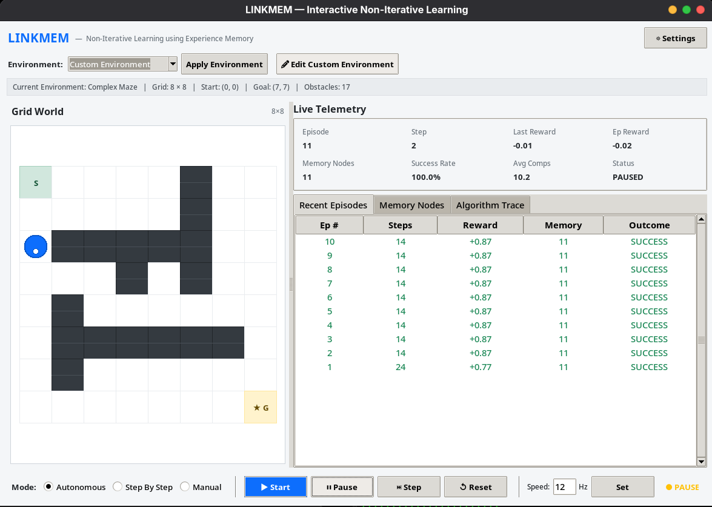
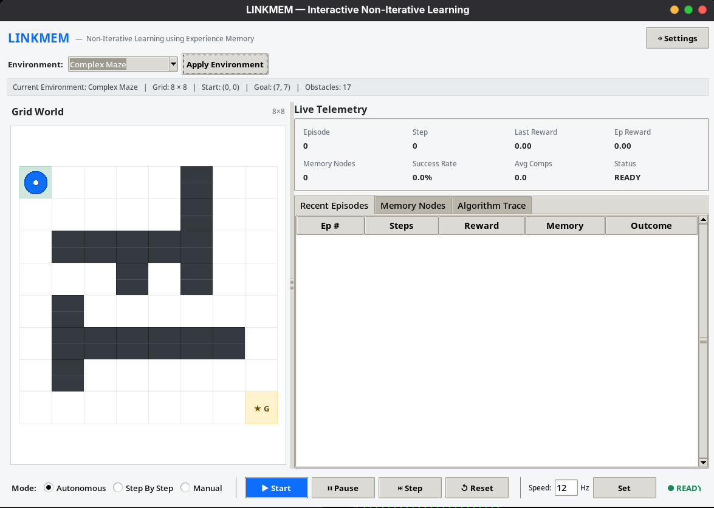
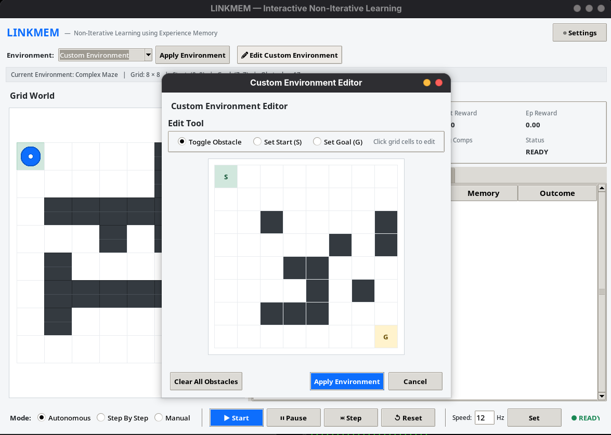

# LINKMEM

**LINKMEM** is a learning and navigation project where an agent learns to move through a 2D grid using a simple experience memory instead of a neural network.

The agent remembers what it did in previous situations and uses those experiences when it encounters similar situations again.

## Screenshots

### Main Interface


### Algorithm Trace & Memory


### Analysis


### Custom Environment


## What does it do?

The project puts an agent inside a grid world with a start point, a goal, and optional obstacles.

The agent:

1. Looks at its current position and surroundings.
2. Checks its previous experiences.
3. Chooses an action based on the closest experience.
4. Moves through the grid and receives a reward.
5. Updates the experience stored in memory.

The goal is to reach the target while avoiding obstacles and unnecessary loops.

The experience memory is implemented as a **singly linked list**, so the agent searches through stored experiences instead of using a neural network.

## Main Features

- Interactive Tkinter GUI
- Live grid showing the agent's movement
- Algorithm trace showing decisions
- Visual experience-memory viewer
- Analysis charts and episode statistics
- Autonomous, step-by-step, and manual modes
- Multiple test environments
- Random obstacle generation
- Custom environment editor
- Loop/cycle avoidance
- Configurable learning parameters
- Benchmark experiments for different distance thresholds

### Environments

- **Empty Grid** — open environment
- **Simple Maze** — small fixed maze
- **Complex Maze** — larger maze with multiple barriers
- **Random Obstacles** — automatically generated obstacles
- **Custom Environment** — create your own layout

## How the Learning Works

Each experience stores information about a state, the action taken, and the reward received.

When the agent reaches a state, it searches its linked-list memory for the closest stored state.

If the state is similar enough, the agent can reuse the previous action. Otherwise, it explores and stores a new experience.

The distance threshold is controlled by **θ (theta)**.

The reward estimate is updated using: text Q_new = Q_old + (reward - Q_old) / n

## Installation & Requirements

LINKMEM requires Python 3.10+ (tested on Python 3.14). Dependencies include standard library Tkinter and Matplotlib.

```bash
# Clone the repository
git clone https://github.com/karrtikmeow/LINKMEM.git
cd LINKMEM

# Set up virtual environment
python3 -m venv .venv
source .venv/bin/activate

# Install dependencies
pip install -e .
```

## How to Run

### Interactive GUI
```bash
python -m linkmem
```

### Headless Demo
Run a quick terminal-only demonstration without opening a window:
```bash
python -m linkmem --headless
```

### Empirical Benchmark
Run experiments across different theta values (0.10, 0.20, 0.35, 0.50, 0.75) and all preset environments:
```bash
python -m linkmem --benchmark
```
This writes summary metrics to `results/benchmark_results.csv` and generates comparison plots in the `results/` folder.

## Testing

The project includes an extensive test suite covering the core data structures, distance metrics, state encoder, agent navigation, learning engine, environment switching, and benchmarks:

```bash
# Run tests
pytest

# Run tests in verbose mode
pytest -v
```


